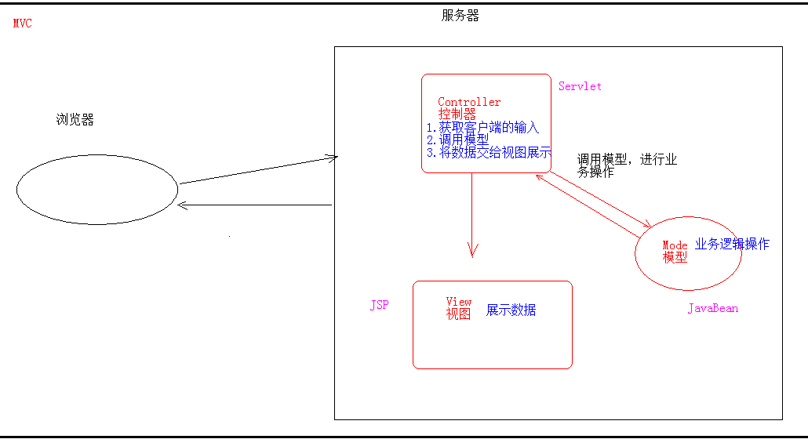

# MVC：开发模式	

##1. jsp演变历史

	1. 早期只有servlet，只能使用response输出标签数据，非常麻烦
	2. 后来有jsp，简化了Servlet的开发，如果过度使用jsp，在jsp中即写大量的java代码，又写html，造成难于维护，难于分工协作
	3. 再后来，java的web开发，借鉴mvc开发模式，使得程序的设计更加合理性
##2. MVC

	1. M：Model，模型。JavaBean
		* 完成具体的业务操作，如：查询数据库，封装对象
	2. V：View，视图。JSP
		* 展示数据
	3. C：Controller，控制器。Servlet
		* 获取用户的输入
		* 调用模型
		* 将数据交给视图进行展示
## 3. 图解



##	4. 优缺点

	1. 优点：
		1. 耦合性低，方便维护，可以利于分工协作
		2. 重用性高
	
	2. 缺点：
		1. 使得项目架构变得复杂，对开发人员要求高


# 三层架构：软件设计架构

	1. 界面层(表示层)：用户看的得界面。用户可以通过界面上的组件和服务器进行交互
	2. 业务逻辑层：处理业务逻辑的。
	3. 数据访问层：操作数据存储文件。


# EL表达式

	1. 概念：Expression Language 表达式语言
	2. 作用：替换和简化jsp页面中java代码的编写
	3. 语法：${表达式}
	4. 注意：
		* jsp默认支持el表达式的。如果要忽略el表达式
			1. 设置jsp中page指令中：isELIgnored="true" 忽略当前jsp页面中所有的el表达式
			2. \${表达式} ：忽略当前这个el表达式

##使用

###1. 运算符

	1. 算数运算符： + - * /(div) %(mod)
	2. 比较运算符： > < >= <= == !=
	3. 逻辑运算符： &&(and) ||(or) !(not)
```jsp
<%@ page import="java.util.List" %>
<%@ page import="java.util.ArrayList" %>
<%@ page contentType="text/html;charset=UTF-8" language="java"   %>
<html>
<head>
    <title>el获取域中的数据</title>
</head>
<body>
    ${3 > 4}<br/>
    \${3 > 4}
<hr>
    <h3>算数运算符</h3>
    ${3 + 4}<br>
    ${4 / 2}<br>
    ${4 div 2}<br>
    ${4 % 3}<br>
    ${4 mod 3}<br>
<hr/>
    <h3>比较运算符</h3>
    ${3 == 4}<br>
<hr/>
    <h3>逻辑运算符</h3>
    ${3 > 4  && 3 < 4}<br>
    ${3 > 4  and 3 < 4}<br>
</body>
</html>
```

###2. 获取值

> el表达式只能从域对象中获取值

####1. 获取简单数据

	1. ${域名称.键名}：从指定域中获取指定键的值
		* 域名称：
			1. pageScope		--> pageContext
			2. requestScope 	--> request
			3. sessionScope 	--> session
			4. applicationScope --> application（ServletContext）
		* 举例：在request域中存储了name=张三
		* 获取：${requestScope.name}
		* 注意：如果最终找不到对应的键，则会返回空字符串，最终什么都不会显示
	2. ${键名}：表示依次从最小的域中查找是否有该键对应的值，直到找到为止。
```jsp
<%@ page contentType="text/html;charset=UTF-8" language="java" %>
<html>
<head>
    <title>el获取域中的数据</title>
</head>
<body>
    <%
        //在域中存储数据
        session.setAttribute("name","李四");
        request.setAttribute("name","张三");
        session.setAttribute("age","23");
        request.setAttribute("str","");
    %>

    ${requestScope.name}<br/>
    ${sessionScope.age}<br/>
    ${sessionScope.haha}<br/>
    <hr/>
    ${name}
</body>
</html>
```

####3. 获取对象、List集合、Map集合的值

	1. 对象：${域名称.键名.属性名}
		* 本质上会去调用对象的getter方法
		* 注意这里是属性名
		* 属性名：getName()方法去掉get后剩余部分，首字母小写的值就是属性名
	
	2. List集合：${域名称.键名[索引]}
	
	3. Map集合：
		* ${域名称.键名.key名称}
		* ${域名称.键名["key名称"]}
- User

```java
package com.bao.domain;

import java.text.SimpleDateFormat;
import java.util.Date;

public class User {
    private String name;
    private int age;
    private Date birthday;

    public String getName() {
        return name;
    }

    public void setName(String name) {
        this.name = name;
    }

    public int getAge() {
        return age;
    }

    public void setAge(int age) {
        this.age = age;
    }

    public Date getBirthday(){
        return birthday;
    }

    public void setBirthday(Date birthday) {
        this.birthday = birthday;
    }

    @Override
    public String toString() {
        return "User{" +
                "name='" + name + '\'' +
                ", age=" + age +
                ", birthday=" + birthday +
                '}';
    }

    /*
    逻辑视图
     */
    public String getBirStr() {
        SimpleDateFormat simpleDateFormat = new SimpleDateFormat("yyyy-MM-dd HH:mm:ss");
        String formatDate = simpleDateFormat.format(birthday);
        return formatDate;
    }
}
```

- el.jsp

```jsp
<%@ page import="com.bao.domain.User" %>
<%@ page import="java.util.*" %>
<%@ page contentType="text/html;charset=UTF-8" language="java" %>
<html>
<head>
    <title>el获取数据</title>
</head>
<body>

    <%
        User user = new User();
        user.setName("张三");
        user.setAge(23);
        user.setBirthday(new Date());
        request.setAttribute("u",user);

        List list = new ArrayList();
        list.add("aaa");
        list.add("bbb");
        list.add(user);
        request.setAttribute("list",list);

        Map map = new HashMap();
        map.put("sname","李四");
        map.put("gender","男");
        map.put("user",user);
        request.setAttribute("map",map);
    %>
    <h3>el获取对象</h3>
    ${requestScope.u}<br>
    ${requestScope.u.name}<br>
    ${u.age}<br>
    ${u.birthday}<br>
    ${u.birStr}<br>
    <%--${u.hahah}<br>--%><%--会报错--%>

    <h3>el获取List值</h3>
    ${list}<br>
    ${list[0]}<br>
    ${list[1]}<br>
    ${list[10]}<br><%--没有值，返回空字符串--%>
    ${list[2].name}

    <h3>el获取Map值</h3>
    ${map.gender}<br>
    ${map["gender"]}<br>
    ${map.user.name}

</body>
</html>
```

####3. 获取隐式对象

	* el表达式中有11个隐式对象，我们这里只学习一个pageContext
	* pageContext：
		* 获取jsp其他八个内置对象
			* ${pageContext.request.contextPath}：动态获取虚拟目录
```jsp
<%@ page contentType="text/html;charset=UTF-8" language="java" %>
<html>
<head>
    <title>el隐式对象</title>
</head>
<body>
    ${pageContext.request}<br>
    ${pageContext.session}<br>
    <h4>在jsp页面动态获取虚拟目录</h4>
    ${pageContext.request.contextPath}
</body>
</html>
```

###3. 空运算符： empty

```
* 功能：用于判断字符串、集合、数组对象是否为null或者长度是否为0
* ${empty list}:判断字符串、集合、数组对象是否为null或者长度为0 (为空返回true)
* ${not empty str}:表示判断字符串、集合、数组对象是否不为null 并且 长度>0 (为空返回false)
```

```jsp
<%@ page import="java.util.ArrayList" %>
<%@ page import="java.util.Map" %>
<%@ page import="java.util.HashMap" %>
<%@ page contentType="text/html;charset=UTF-8" language="java" %>
<html>
<head>
    <title>el</title>
</head>
<body>
    <%
        String string1 = "";
        String string2 = " ";
        String string3 = null;
        String string4 = "abc";
        request.setAttribute("string1",string1);
        request.setAttribute("string2",string2);
        request.setAttribute("string3",string3);
        request.setAttribute("string4",string4);

        ArrayList arrayList = new ArrayList();
        arrayList.add(string1);
        request.setAttribute("arrayList",arrayList);

        Map<String,String> map = new HashMap<String, String>();
        map.put("string","aaa");
        request.setAttribute("map",map);
    %>
    ${empty string1}<br/>
    ${empty string2}<br/>
    ${empty string3}<br/>
    ${empty string4}<br/>
<hr/>
    ${not empty string1}<br/>
    ${not empty string2}<br/>
    ${not empty string3}<br/>
    ${not empty string4}<br/>
<hr/>
    ${not empty arrayList}
<hr/>
    ${not empty map}
</body>
</html>
```


# JSTL

	1. 概念：JavaServer Pages Tag Library  JSP标准标签库
		* 是由Apache组织提供的开源的免费的jsp标签		<标签>
	
	2. 作用：用于简化和替换jsp页面上的java代码		
	
	3. 使用步骤：
		1. 导入jstl相关jar包
		2. 引入标签库：taglib指令：  <%@ taglib %>
		3. 使用标签

##常用的JSTL标签
###1. if:相当于java代码的if语句
    * test属性为必须要写的属性，接受boolean表达式
        * 如果表达式为true，则显示if标签体内容，如果为false，则不显示标签体内容
        * 一般情况下，test属性值会结合el表达式一起使用
        注意：c:if标签没有else情况，想要else情况，则可以在再义一个c:if标签
```jsp
<%@ page import="java.util.List" %>
<%@ page import="java.util.ArrayList" %>
<%@ page contentType="text/html;charset=UTF-8" language="java" %>
<%@ taglib prefix="c" uri="http://java.sun.com/jsp/jstl/core" %>

<html>
<head>
    <title>if标签</title>
</head>
<body>
    <c:if test="true">
        <h1>我爱java</h1>
    </c:if>
    <c:if test="false">
        <h1>我不爱java</h1>
    </c:if>
    <c:if test="${4 > 3}">
        <h1>我也爱MySQL</h1>
    </c:if>

</body>
</html>
```

###2. choose:相当于java代码的switch语句
	1. 使用choose标签声明         		 相当于switch声明
	2. 使用when标签做判断         			相当于case
	3. 使用otherwise标签做其他情况的声明     相当于default
```jsp
<%@ page contentType="text/html;charset=UTF-8" language="java" %>
<%@taglib prefix="c" uri="http://java.sun.com/jsp/jstl/core" %>

<html>
<head>
    <title>choose标签</title>
</head>
<body>
    <%--
        完成数字编号对应星期几案例
            1.域中存储一数字
            2.使用choose标签取出数字         相当于switch声明
            3.使用when标签做数字判断         相当于case
            4.otherwise标签做其他情况的声明  相当于default
    --%>
    <%
        request.setAttribute("number",5);
    %>
    <c:choose>
        <c:when test="${number == 1}">星期一</c:when>
        <c:when test="${number == 2}">星期二</c:when>
        <c:when test="${number == 3}">星期三</c:when>
        <c:when test="${number == 4}">星期四</c:when>
        <c:when test="${number == 5}">星期五</c:when>
        <c:when test="${number == 6}">星期六</c:when>
        <c:when test="${number == 7}">星期天</c:when>

        <c:otherwise>数字输入有误</c:otherwise>
    </c:choose>

</body>
</html>
```

###3. foreach:相当于java代码的for语句

```java
1. 完成重复的操作
    for(int i = 0; i < 10; i ++){

    }
    * 属性：
        begin：开始值
        end：结束值
        var：临时变量
        step：步长
        varStatus:循环状态对象
            index:容器中元素的索引，从0开始
            count:循环次数，从1开始
2. 遍历容器
    List<User> list;
    for(User user : list){

    }
    * 属性：
        items:容器对象
        var:容器中元素的临时变量
        varStatus:循环状态对象
            index:容器中元素的索引，从0开始
            count:循环次数，从1开始
```

```jsp
<%@ page import="java.util.ArrayList" %>
<%@ page import="java.util.List" %>
<%@ page contentType="text/html;charset=UTF-8" language="java" %>
<%@taglib prefix="c" uri="http://java.sun.com/jsp/jstl/core" %>

<html>
<head>
    <title>foreach标签</title>
</head>
<body>
    <table border="1">
        <tr>
            <th>循环次数</th>
            <th>索引</th>
            <th>临时变量</th>
        </tr>
        <c:forEach begin="0" end="5" var="i" step="1" varStatus="s">
            <tr>
                <td>${s.count}</td>
                <td>${s.index}</td>
                <td>${i}</td>
            </tr>
        </c:forEach>
    </table>
    
    <%
            List list = new ArrayList();
            list.add("aaa");
            list.add("bbb");
            list.add("ccc");
            request.setAttribute("list",list);
    %>
    
    <table border="1">
        <tr>
            <th>循环次数</th>
            <th>索引</th>
            <th>临时变量</th>
        </tr>
        <c:forEach items="${list}" var="str" varStatus="s">
            <tr>
                <td>${s.count}</td>
                <td>${s.index}</td>
                <td>${str}</td>
            </tr>
        </c:forEach>
    </table>
    
    <table border="1">
        <tr>
            <th>循环次数</th>
            <th>索引</th>
            <th>临时变量</th>
        </tr>
        <c:forEach items="${list}" var="str" varStatus="s" begin="0" end="1" step="1">
            <tr>
                <td>${s.count}</td>
                <td>${s.index}</td>
                <td>${str}</td>
            </tr>
        </c:forEach>
    </table>
</body>
</html>
```

## 案例：用户信息展示

> 需求：request域中存有一个装有user对象的list集合，使用jstl和el将list集合中的user对象展示到jsp的table表格中

```jsp
<%@ page import="com.bao.domain.User" %>
<%@ page import="java.util.ArrayList" %>
<%@ page import="java.util.Date" %>
<%@ page import="java.util.List" %>
<%@ page contentType="text/html;charset=UTF-8" language="java" %>
<%@taglib prefix="c" uri="http://java.sun.com/jsp/jstl/core" %>
<html>
<head>
    <title>test</title>
</head>
<body>
    <%
        List list = new ArrayList();
        list.add(new User("张三",23,new Date()));
        list.add(new User("李四",24,new Date()));
        list.add(new User("王五",25,new Date()));
        request.setAttribute("list",list);
    %>
    <table border="1" width="500" align="center">
        <tr>
            <th>编号</th>
            <th>姓名</th>
            <th>年龄</th>
            <th>生日</th>
        </tr>
        <%--数据行--%>
        <c:forEach items="${list}" var="user" varStatus="s">
            <c:if test="${s.count % 2 != 0}">
                <tr bgcolor="red">
                    <td>${s.count}</td>
                    <td>${user.name}</td>
                    <td>${user.age}</td>
                    <td>${user.birStr}</td>
                </tr>
            </c:if>
            <c:if test="${s.count % 2 == 0}">
                <tr  bgcolor="green">
                    <td>${s.count}</td>
                    <td>${user.name}</td>
                    <td>${user.age}</td>
                    <td>${user.birStr}</td>
                </tr>
            </c:if>
        </c:forEach>
    </table>
</body>
</html>
```